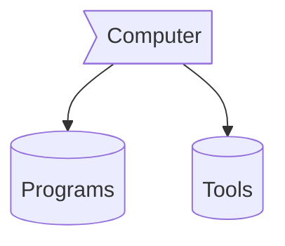

<div align="center">
<svg xmlns="http://www.w3.org/2000/svg" viewBox="0 0 1440 320"><path fill="#273036" fill-opacity="1" d="M0,160L40,133.3C80,107,160,53,240,37.3C320,21,400,43,480,80C560,117,640,171,720,202.7C800,235,880,245,960,224C1040,203,1120,149,1200,160C1280,171,1360,245,1400,282.7L1440,320L1440,0L1400,0C1360,0,1280,0,1200,0C1120,0,1040,0,960,0C880,0,800,0,720,0C640,0,560,0,480,0C400,0,320,0,240,0C160,0,80,0,40,0L0,0Z"></path></svg><h1></img>!Bravo,</img></h1>
</img>
</div>


<svg xmlns="http://www.w3.org/2000/svg" viewBox="0 0 1440 320"><path fill="#273036" fill-opacity="1" d="M0,160L40,133.3C80,107,160,53,240,37.3C320,21,400,43,480,80C560,117,640,171,720,202.7C800,235,880,245,960,224C1040,203,1120,149,1200,160C1280,171,1360,245,1400,282.7L1440,320L1440,0L1400,0C1360,0,1280,0,1200,0C1120,0,1040,0,960,0C880,0,800,0,720,0C640,0,560,0,480,0C400,0,320,0,240,0C160,0,80,0,40,0L0,0Z"></path></svg>

<div align="center">
</img><br>
</img>
</div>
 <p align="center">

 
  
                  
  <br>
<div align="center">


</div>

         
  <br>
  


 <div align="center">

 <b> Languages and Tools:
 
 <code></code><code></code><code></code><code></code>
<br /><code></code><code></code><code></code><code></code>
<br />
<code></code><code></code><code></code><code></code>
<br /><code></code><code></code><code></code><code></code>
<br /><code></code><code></code><code></code><code></code>
<br />
<code></code><code></code><code></code><code></code><br />
<code></code><code></code><code></code><code></code>
<br />
<code></code><code></code><code></code><code></code>
</div>

 
  <br>
</p>

### Computer :> Programs && Tools



-  **Vscode** not for web it for everything
-  Chromium base web browser like **Firefox** 
-  <a href="https://getpaint.net">**Gimp**</a> for image manipulation
-  linux I highly prefer Arch. but, sometimes you can rely on debiun. so, **PopsOs** by (System76)

- 🌱 I’m currently learning more about **Reactjs(Nextjs)**.
- 👯 I’m looking to collaborate on [github](https://github.com/DSDarkMark/project_short "DSmark Project").
- 🤔 I’m looking for help with Nextjs documentation.
- 💬 Ask me about web Development or any tech-related stuff.
- 😄 Pronouns: He/His
- ⚡ Fun fact: I spend almost time to watch **anime**.

## Technologies 

```mermaid
flowchart 
f1[HTML]
f2[Css]
f3[javaScpit]
f4[Markdown]
fw1((ReactJs))
fw2((NextJs))
fw3((Bootstrap))
fw4((tailwind))
fw5((Scss))
fw6((mermaid))
b1{NodeJs}
b2{RestAPIs}
b3{PHP}
 subgraph  BackEnd
b1
b2
b3
 end  
 subgraph Framworks 
fw1
fw2
fw3
fw4
fw5
fw6
 end
  subgraph  FrontEnd 
 f1
 f2
 f3
 f4
 end  
 f1 --o f2
 f1 --o f3
 f1 --o f4
 f2 --> fw3
 f2 --> fw4
 f2 --> fw5
 f3 --o fw1
 f3 --o fw2
 fw2 --o b1
 f4 --> fw6
 b1 --o b2
 ```

## Touch Me  ˊ•⌔•ˋ 

|[Discord](https://discord.gg/xm4DN6JTVt)|[Github](https://github.com/DSDmark/)|[LinkIn]()|[DevToCommunity](https://dev.to/dsmark)|[Gmail](sahup3296@gmail.com)|
|:-|:-|:-|:-|:--|
---

> **Youth is a lie. It is nothing but evil.**

Those who rejoice in youth deceive themselves and those around them, accepting in full the circumstances that devour them. 
ʕ •́؈•̀ ₎
In the face of the word " **Youth**  ", they will twist any common interpretation or accepted notion out of recognition.

In their minds, lies, secrets, sins, and failure are nothing more than the spice of youth.

If failure is truly the proof of one's youth...

Then is there not something abnormal about But I am sure none of them would admit to this. It is all a double standard.

My conclusion is this All you fools who delight in youth...

> **Be Drop Dead.**

  <p align="center">
  </center>
</p>

svg xmlns="http://www.w3.org/2000/svg" viewBox="0 0 1440 320"><path fill="#273036" fill-opacity="1" d="M0,96L30,112C60,128,120,160,180,192C240,224,300,256,360,250.7C420,245,480,203,540,170.7C600,139,660,117,720,128C780,139,840,181,900,208C960,235,1020,245,1080,245.3C1140,245,1200,235,1260,213.3C1320,192,1380,160,1410,144L1440,128L1440,320L1410,320C1380,320,1320,320,1260,320C1200,320,1140,320,1080,320C1020,320,960,320,900,320C840,320,780,320,720,320C660,320,600,320,540,320C480,320,420,320,360,320C300,320,240,320,180,320C120,320,60,320,30,320L0,320Z"></path></svg>

---


